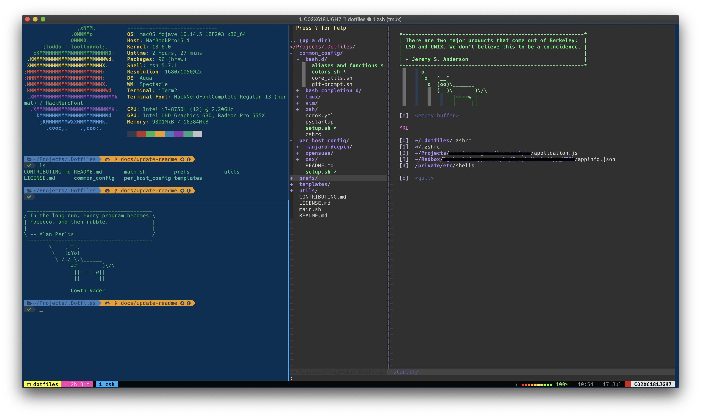

# Personal dotfiles

> For Manjaro Deepin, OSX and OpenSUSE tumbleweed

This is refactored and upgraded version of my [old dotfiles](https://github.com/Puritanic/Dotfiles). This is a set of config files and tools I'm using (almost) everyday. Feel free to fork/clone this repo but take care that many of this configs are tailored to my own taste.

 

### Prerequisites

Some of the tools are required to be installed before executing dotfiles shellscripts. Those are:

- `git`
- `curl` 

Most of these tools are usually pre-installed on UNIX distributions, and if not those will usually be installed by running system update:

- `brew update && brew upgrade` - OSX (Mojave)
- `sudo zypper dup` - OpenSUSE Tumbleweed
- `sudo pacman -Syyu` - Manjaro (Deepin)

## Getting Started

**Make `main.sh` executable with `chmod +x`.** Before starting `main.sh` create a `.machine` file in you `$HOME` directory, with name of your host inside.
If you don't do this, setup will try to install `per_host_config` by creating `.machine` file with your `hostname` inside, but this is not often a working solution.
If you don't wan't to install any of the preconfigured host configs you can skip this step, and setup will work just fine, installing only common_config and utils.

### Installing

Just run `.main.sh` and follow the installation process, you'll need to enter your sudo password a few times in order to install packages (if on linux) and to change default shell from `bash` to `zsh`*. 

> Note: Installation is a pretty verbose, as I've wanted everything done to be displayed in terminal. you can clean output a bit bu removing verbose flag from creating symlinks beside other things.

## Contributing

Please read [CONTRIBUTING.md](CONTRIBUTING.md) for details on our code of conduct, and the process for submitting pull requests to us.

## License

This project is licensed under the MIT License - see the [LICENSE.md](LICENSE.md) file for details

## Acknowledgments

* Hat tip to anyone whose code was used, there is a lot of stuff borrowed from other people's dotfiles.
* Kudos to [@fatso83](https://github.com/fatso83) for idea how to automate installation for multiple hosts